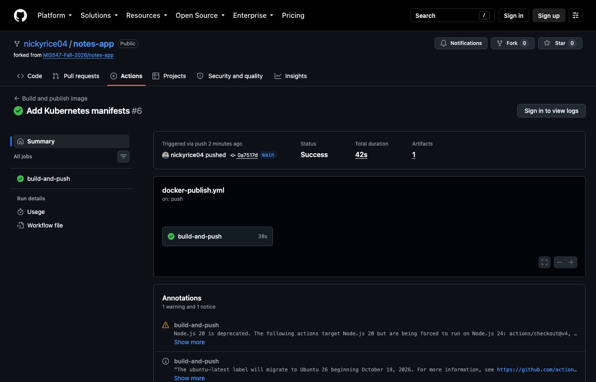
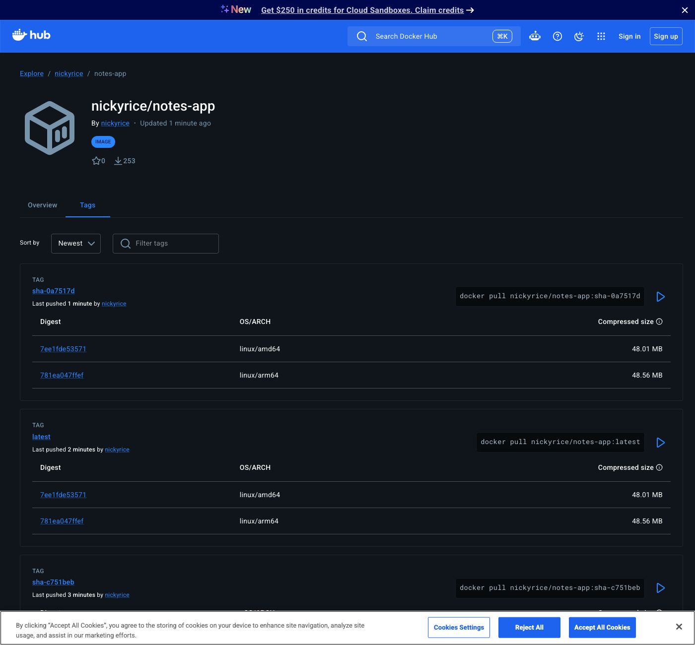

# Lab 5 Evidence

1. A screenshot of a successful GitHub Actions run



2. A screenshot of your Docker Hub tags page showing both architectures



3. The output of kubectl get all,pvc from your running cluster

```
NAME                      READY   STATUS    RESTARTS   AGE
pod/db-6c5c8947cd-n9lgk   1/1     Running   0          4m30s
pod/web-cbf7bb59c-hkffq   1/1     Running   0          2m3s
pod/web-cbf7bb59c-s9jjm   1/1     Running   0          2m10s

NAME          TYPE        CLUSTER-IP      EXTERNAL-IP   PORT(S)    AGE
service/db    ClusterIP   10.96.116.43    <none>        5432/TCP   5m46s
service/web   ClusterIP   10.96.255.104   <none>        80/TCP     5m24s

NAME                  READY   UP-TO-DATE   AVAILABLE   AGE
deployment.apps/db    1/1     1            1           5m46s
deployment.apps/web   2/2     2            2           5m24s

NAME                             DESIRED   CURRENT   READY   AGE
replicaset.apps/db-6c5c8947cd    1         1         1       5m46s
replicaset.apps/web-68dbbfdcbd   0         0         0       2m35s
replicaset.apps/web-cbf7bb59c    2         2         2       5m24s

NAME                            STATUS   VOLUME                                     CAPACITY   ACCESS MODES   STORAGECLASS   VOLUMEATTRIBUTESCLASS   AGE
persistentvolumeclaim/db-data   Bound    pvc-8013923e-31e6-4007-8363-8b5d3182b3d0   1Gi        RWO            standard       <unset>                 5m46s
```

4. The output of the curl commands from Experiments 2 and 3 in Part 3 (persisted notes and multiple served_by values)

Experiment 2

```
$ curl -X POST http://localhost:8000/notes -H "Content-Type: application/json" -d '{"body": "I should survive a pod deletion"}'
{"body":"I should survive a pod deletion","id":2}
$ kubectl delete pod -l app=db
pod "db-6c5c8947cd-6f24k" deleted from notes-lab namespace
$ curl http://localhost:8000/notes
[{"body":"hello from kubernetes","created_at":"2026-09-27T14:24:54.626807+00:00","id":1},{"body":"I should survive a pod deletion","created_at":"2026-09-27T14:25:17.239446+00:00","id":2}]
```

Experiment 3

```
$ kubectl run curl --restart=Never --image=curlimages/curl -- sh -c 'for i in 1 2 3 4 5 6 7 8; do curl -s http://web/; echo; done'
$ kubectl logs curl
{"message":"Hello from the notes app, now on Kubernetes!","served_by":"web-cbf7bb59c-hkffq","service":"notes-app"}
{"message":"Hello from the notes app, now on Kubernetes!","served_by":"web-cbf7bb59c-s9jjm","service":"notes-app"}
{"message":"Hello from the notes app, now on Kubernetes!","served_by":"web-cbf7bb59c-hkffq","service":"notes-app"}
{"message":"Hello from the notes app, now on Kubernetes!","served_by":"web-cbf7bb59c-8jdd4","service":"notes-app"}
{"message":"Hello from the notes app, now on Kubernetes!","served_by":"web-cbf7bb59c-hkffq","service":"notes-app"}
{"message":"Hello from the notes app, now on Kubernetes!","served_by":"web-cbf7bb59c-hkffq","service":"notes-app"}
{"message":"Hello from the notes app, now on Kubernetes!","served_by":"web-cbf7bb59c-8jdd4","service":"notes-app"}
{"message":"Hello from the notes app, now on Kubernetes!","served_by":"web-cbf7bb59c-8jdd4","service":"notes-app"}
```

5. The output of kubectl rollout history deployment/web after your rolling update

```
deployment.apps/web
REVISION  CHANGE-CAUSE
1         <none>
2         <none>
```
